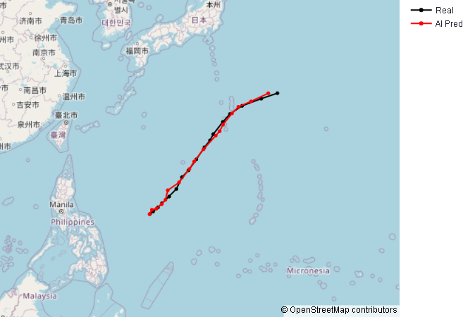
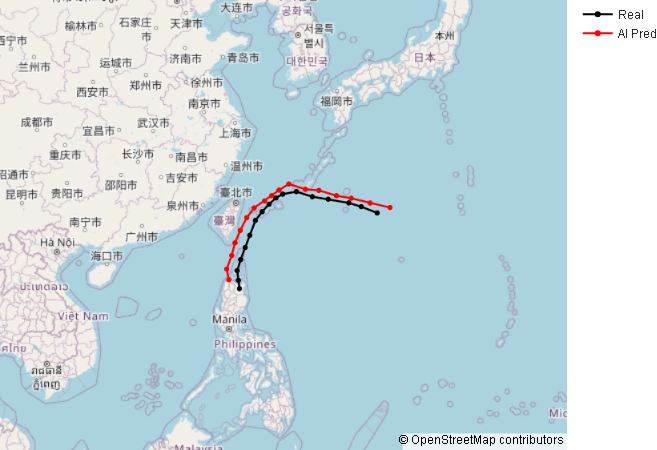

# TCP-OWZP: Tropical Cyclone Prediction - Okubo–Weiss–Zeta-Parameters


 
 

A deep learning framework for tropical cyclone track and intensity forecasting using Transformer architecture, inspired by the OWZP-Transformer research.

## 🌪️ Overview

This project implements a Transformer-based model for predicting tropical cyclone (TC) tracks and intensities in the Western North Pacific basin. The model uses an encoder-decoder architecture to forecast cyclone positions, intensities, and key meteorological parameters.

### Key Features

- **Encoder-Decoder Transformer** architecture for sequence-to-sequence prediction
- **Multi-head self-attention** (8 heads) for capturing temporal dependencies
- **Teacher forcing** training strategy with causal masking
- **Xavier initialization** for stable convergence
- **Early stopping** with learning rate scheduling
- Support for **multiple meteorological features** including:
  - Basic factors (latitude, longitude, intensity, MSLP)
  - Environmental factors (humidity, wind shear)
  - Gradient factors (steering flow, translation speed)

### Performance

Based on the OWZP-Transformer methodology, models in this framework can achieve:
- Track error MAE: **~58.73 km (6-hour forecast)**
- Track error MAE: **~70.33 km (6-hour forecast)**
- Intensity MAE: **~1.858 m/s**
- Pressure MAE: **~3.082 hPa**

### Run

```bash
# Clone the repository
git clone https://github.com/Yumeio/tcp-owzp.git
cd tcp-owzp
# Or use requirements.txt (if available)
pip install -r requirements.txt

# Run streamlit to show my model
streamlit run web.py
```


## 📖 References

### Papers

- **OWZP-Transformer (2025)**
   - Lin, Z., Chu, J.-E., & Ham, Y.-G.
   - "Enhancing tropical cyclone track and intensity predictions with the OWZP-Transformer model"
   - *npj Artificial Intelligence*, 1, 33
   - DOI: [10.1038/s44387-025-00037-3](https://doi.org/10.1038/s44387-025-00037-3)

- **Attention Is All You Need (2017)**
   - Vaswani et al.
   - Original Transformer architecture
   - NeurIPS 2017 [1706.03762](https://arxiv.org/abs/1706.03762)
  
### Datasets

- [IBTrACS](https://www.ncdc.noaa.gov/ibtracs/)
- [ERA5](https://www.ecmwf.int/en/forecasts/datasets/reanalysis-datasets/era5)
- [MERRA-2](https://gmao.gsfc.nasa.gov/reanalysis/MERRA-2/)

Last updated: November 2025